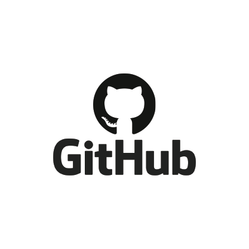
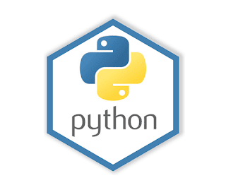

# Проект автоматизации тестирования  <a target="_blank" href="https://citilink.ru/">Ситилинк</a> 

## :open_book: Содержание:
- [Технологии и инструменты](#gear-в-проекте-используются-следующие-технологии-и-инструменты)
- [Что проверяем](#heavy_check_mark-что-проверяем)
- [Запуск тестов из терминала](#computer-запуск-тестов-из-терминала)
- [Отчеты](#bar_chart-отчеты-о-прохождении-тестов-доступны-в-allure)
- [Видео](#movie_camera-видео-с-прогоном-тестов)
- [Allure TestOps](#-проект-интегрирован-с-allure-testOps)

## :gear: В проекте используются следующие технологии и инструменты:

<p align="center">




</p>

## :heavy_check_mark: Описание
В проекте автоматизирована проверка личного кабинета сайта Ситилинк. 

## :heavy_check_mark: Что проверяют UI тесты

> - Проверка заголовка гланой страницы ЛК
> - Проверка меню навигации 
> - Вход в ЛК
> - Смена пользователя
> - Добавление получателя 
> - Редактирование получателя 
> - Удаления получателя 
> - Добавления адреса 
> - Редактирования адреса
> - Удаления адреса


## :computer: Запуск тестов из терминала

Для запуска необходимо выполнить команду:
```
robot Имя файла.robot
```

## :bar_chart: Отчеты о прохождении тестов доступны в Allure

###  Allure

#### Главная страница


#### Графики


#### Тесты


##### Видео прохождение теста


